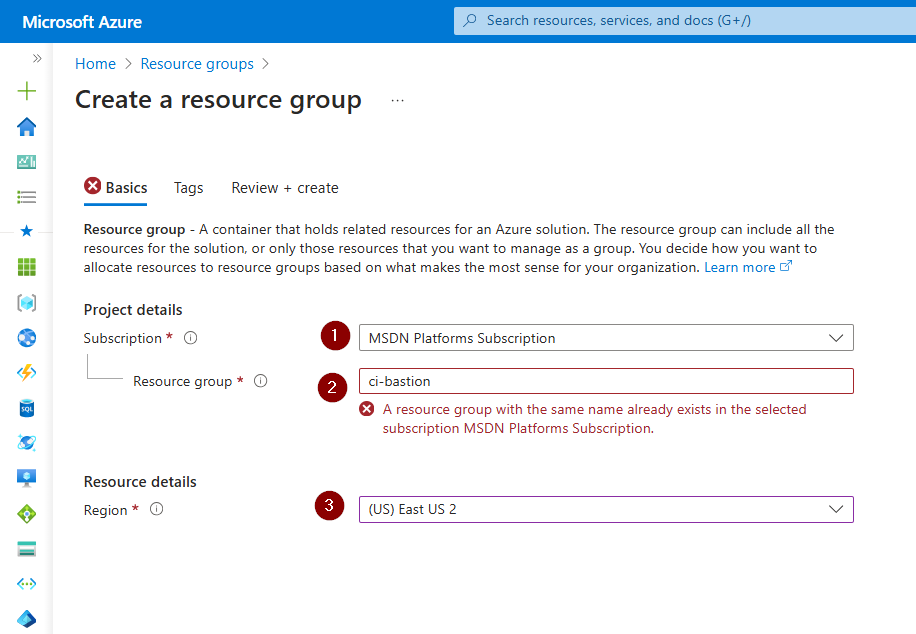
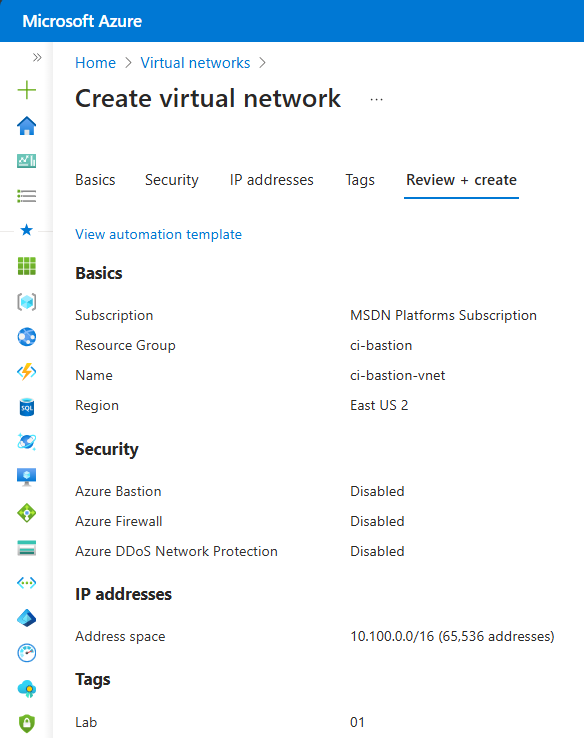
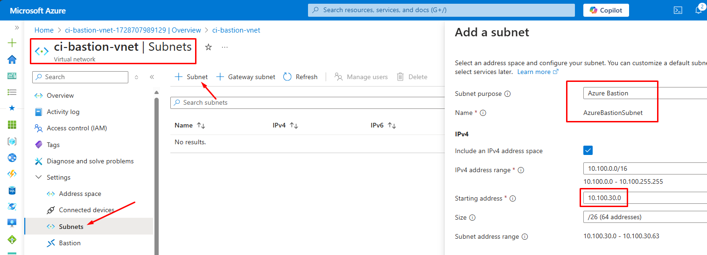
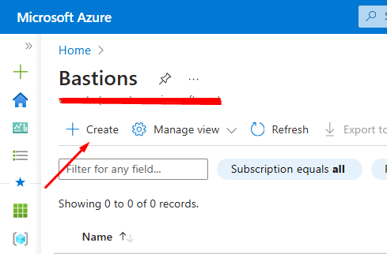
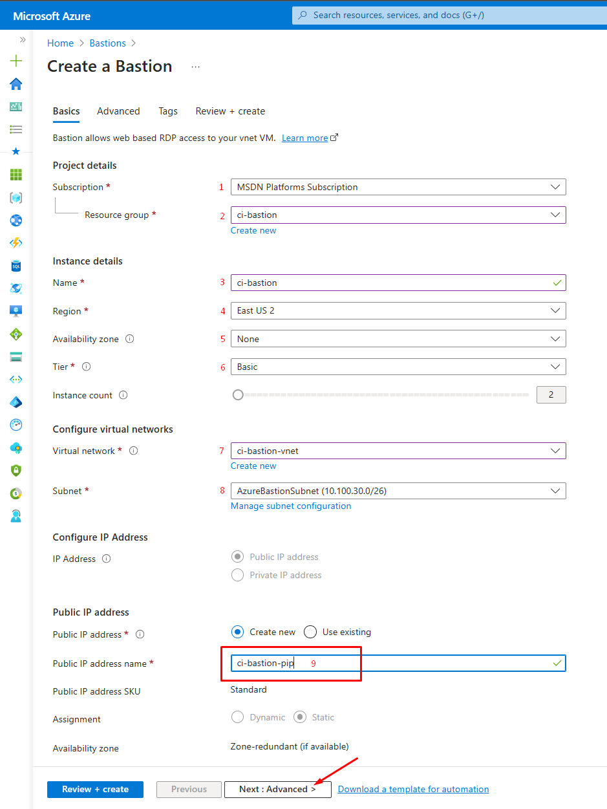
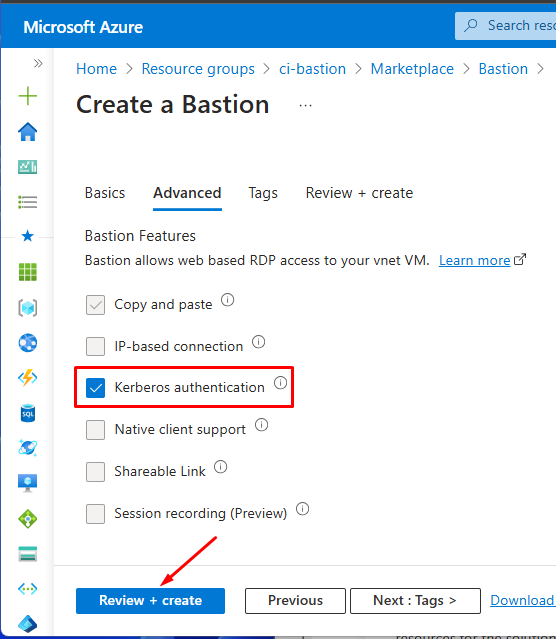
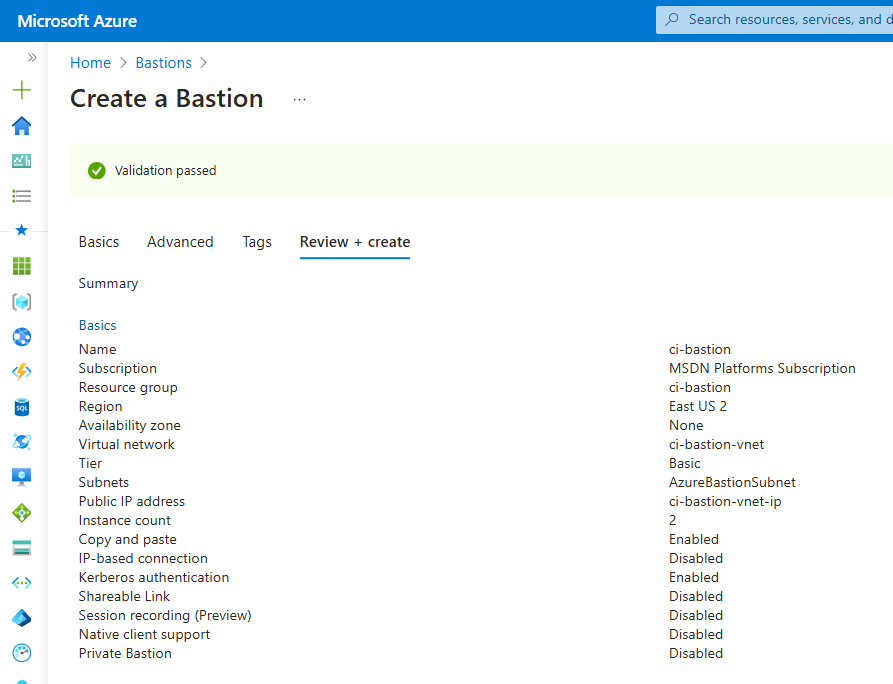

Fala galera!👋

**Bem-vindo ao Blog Cloud Insights!** ☁️

Em nosso primeiro post, vamos explorar como implantar e utilizar o Azure Bastion via Portal.

### Azure Bastion

**O que é**:
Azure Bastion é um serviço gerenciado do Azure que permite acesso seguro a máquinas virtuais (VMs) via RDP e SSH, diretamente do portal do Azure, sem a necessidade de endereços IP públicos.

## Por Que Usar o Azure Bastion?

O Azure Bastion elimina a necessidade de endereços IP públicos em suas VMs, reduzindo a superfície de ataque. Ele também facilita o acesso às VMs diretamente pelo portal do Azure, sem necessidade de configurar VPNs ou outros métodos de acesso remoto.

**Para que serve**:
- **Acesso Seguro**: Conexões seguras sem expor as VMs à Internet.
- **Simplicidade**: Conexão direta pelo portal do Azure, sem configuração complexa de rede.
- **Gerenciamento Centralizado**: Facilita o acesso a múltiplas VMs sem comprometer a segurança.

### Cenários de Uso
- **Ambientes de Produção**: Para acesso seguro a VMs críticas.
- **Desenvolvimento e Teste**: Para equipes que precisam acessar VMs de forma rápida e segura.
- **Acesso Remoto Temporário**: Para colaboradores externos sem complicações de rede.

## Pré-requisitos

Antes de fazermos o deploy do Azure Bastion, verifique se você possui:

- Uma conta do Azure com uma assinatura/subscription ativa.

## Implantação do Azure Bastion pelo Portal do Azure

### Passo 1: Acesse o Portal do Azure

1. Faça login no [Portal do Azure](https://portal.azure.com/).

 

### Passo 2: Deploy dos recursos Base

 

1. Crie um novo resource-group

 

            Obs.: Vocês vão notar que no meu caso o Resource-Group já existe.

    

 
 

2. Crie uma nova Virtual Network + AzureBastionSubnet

### Passo 3: Deploy do Azure Bastion

1. Na barra de pesquisa, digite **Bastion** e selecione **Bastion** nos resultados.
2. Clique em **Criar**.

    

 

### Passo 4: Configurar o Bastion

1. **Configurações Básicas**:
   - **Subscription**: Escolha sua Subscription.
   - **Resource-Group**: Selecione o Resource-Group que criamos (ci-bastion)
   - **Nome do Resource**: Forneça um nome para seu host Bastion.
   - **Região**: Escolha a mesma região da sua VNet (East US2).
   - **Availability Zone**: Deixe em none.
   - **Tier**: Selecione Basic. Segue quiser mais explorar mais detalhes sobre os Tiers do Azure Bastion, voce pode conferir [aqui](https://docs.microsoft.com/en-us/azure/bastion/bastion-overview).

        - *Ao escolhermos o tier Basic, ficam pré-definidas 2 instances*.

   - **Virtual Network**: Selecione a virtual network criada (ci-bastion-vnet). Voce vai notar que ele vai identificar automaticamente a subnet do AzureBastion.
   - **Public-IP**: Crie um novo IP-Público. Você pode criar um com o nome: "ci-bastion-pip"

 

    

            Avance para a aba Advanced (Avançado)

 

   - **Kerberos Authentication**: Selecione a unica opção disponivel e clique em Review + Create.

 

    

 
 

2. **Revisar e Criar**:
   - Revise suas configurações e clique em **Criar**.

 
 

    

 

## Conclusão

Agora você sabe como realizar o deploy do Azure Bastion no Microsoft Azure.

Até a próxima!! 😉

    

#CloudInsights #PartiuNuvem #Azure #Tech #Cloud #Security #Network

---

Até a próxima!! 😉
